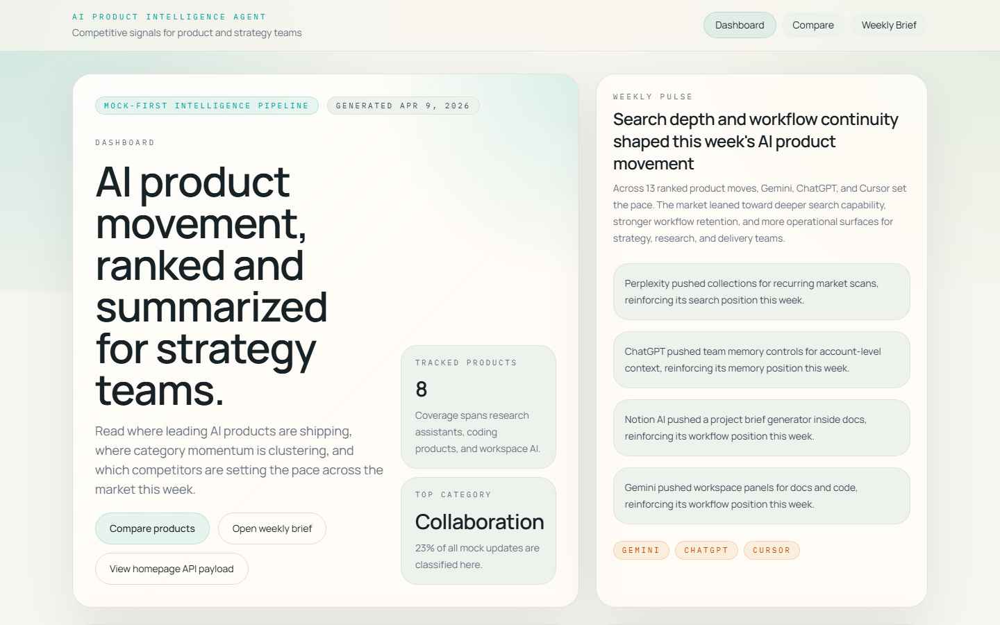
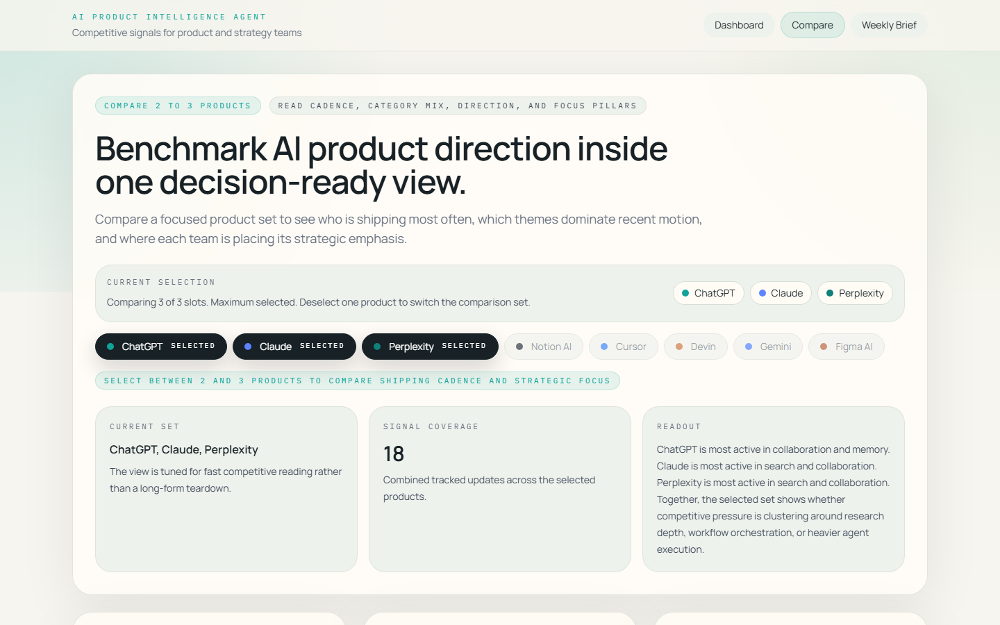
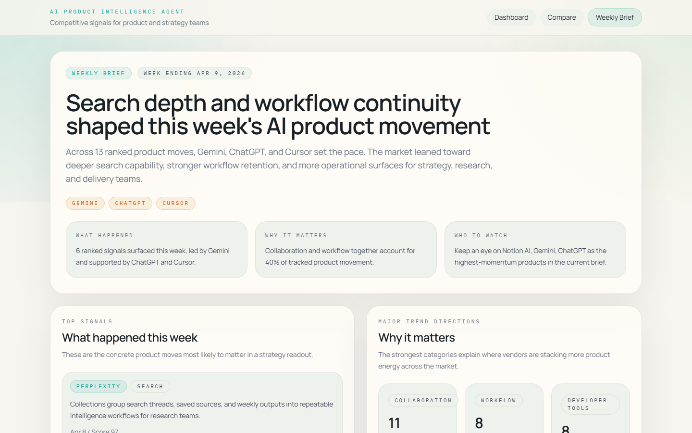

# AI Product Intelligence Agent

A portfolio-ready, mock-first intelligence product for tracking AI product updates, classifying feature change, comparing competitors, and generating a weekly market brief.

This project is intentionally designed as a focused product and data surface for strategy conversations. It is not a chatbot, and it is not a generic RAG demo.

## What It Is

AI Product Intelligence Agent packages a lightweight intelligence pipeline into a polished Next.js dashboard:

- `/` turns recent AI product moves into a market-facing dashboard.
- `/compare` benchmarks 2 to 3 products by cadence, category mix, direction, and pillar focus.
- `/products/[slug]` gives a product-specific read of timeline, category distribution, and recent priorities.
- `/weekly-brief` turns the latest movement into a concise executive-style brief.
- `/runs` acts as a run center for executing official-source research runs, reviewing drafts, and publishing approved output.
- `/api/intelligence` exposes a single homepage payload for the dashboard surface.

The app uses static mock data for the MVP, but the architecture keeps a clean provider boundary so real ingestion can be added later.

The current version now supports three distinct operating modes:

- default routes still use the stable `mock` dataset
- adding `?mode=live` asks the app to pull from official product sources
- adding `?mode=published` reads the latest review-approved research run
- if live fetching fails, the UI automatically falls back to mock data instead of breaking the demo

## Why It Matters

Most AI demos stop at chat. This project takes a different angle: it frames AI as a product-intelligence problem.

- Product and strategy teams need to track shipping velocity, not just ask questions.
- Competitive analysis needs structure, prioritization, and repeatable readouts.
- A demo feels more credible when the UI is powered by a data pipeline instead of hardcoded final copy.

That is why this app renders from:

```text
raw updates -> normalize -> classify -> rank -> summarize -> render
```

## Why This Is An Agent System

This is not a chatbot-first agent. It is a lightweight `research agent / briefing pipeline`.

Its job is to:

- ingest product updates from a source
- normalize them into a consistent structure
- classify and rank the strongest signals
- generate a weekly market brief
- render the results into dashboard, compare, detail, and brief views

The "agent" is the workflow, not a chat box.

The newest addition is a lightweight `Research Run Agent` layer:

- a run executes official-source ingestion across the tracked products
- the system drafts a weekly brief and records source health
- the run moves into `review_required`
- you can then publish or reject it from `/runs/[id]`
- published mode always reads the latest approved run, never the raw live preview

The current live implementation uses eight official-first sources:

- ChatGPT from the OpenAI News RSS feed
- Claude from the Claude Help Center release notes
- Perplexity from the Perplexity API docs changelog
- Notion AI from the Notion releases page
- Cursor from the Cursor changelog
- Devin from the Devin docs release notes
- Gemini from the Google Workspace Updates Gemini feed
- Figma AI from the Figma release notes page

## Demo Flows

### Recommended walkthrough

1. Open the dashboard and explain that the homepage is a ranked market view, not a static landing page.
2. Jump to compare and show how 2 to 3 products can be benchmarked in one compact readout.
3. Open a product detail page to show that the same pipeline can power a deeper single-product analysis.
4. Finish in weekly brief to show how the system turns product events into a strategy-style narrative.
5. If you want to show API readiness, open the same route with `?mode=live` and explain that live mode uses official product sources while mock remains the stable presentation default.

### Short interview script

1. "I wanted to build an AI project that looked like a real product team tool, not a chatbot."
2. "So I modeled the product around a simple intelligence pipeline: raw updates come in, then they are normalized, classified, ranked, summarized, and rendered."
3. "The homepage gives the market-level view, compare shows competitive positioning, product pages show recent focus, and the weekly brief packages it into an executive readout."
4. "It is mock-first for speed, but the provider boundary keeps the ingestion layer replaceable when real feeds or scraping are added."
5. "I also added a lightweight run-and-review workflow, so the app now has a real `mock / live / published` lifecycle instead of only direct rendering."

### Screenshots







## Tech

- Next.js 16 with App Router
- React 19
- TypeScript
- Tailwind CSS 4
- Recharts for charts
- Vitest for pipeline validation
- One API route for homepage intelligence payloads

Key implementation choices:

- Mock-first architecture to ship a complete product surface before real ingestion
- Rule-based classification and summary generation to keep the system explainable
- Shared builders so pages and API routes consume the same derived intelligence payloads
- JSON-backed run store for review/publish flows without introducing a database
- Portfolio/demo packaging via metadata, Open Graph assets, branded iconography, and route-level copy

## Pipeline

Core data files live in `src/lib/intelligence/`:

- `raw-updates.ts`: mock release events for tracked AI products
- `update-normalizer.ts`: converts raw text into a consistent internal representation
- `update-classifier.ts`: assigns category, change type, focus tags, and importance
- `update-ranker.ts`: applies recency and importance weighting
- `summary-generator.ts`: produces weekly insights, product direction, recent focus, and comparison narrative
- `builders.ts`: assembles dashboard, detail, compare, and weekly-brief payloads
- `types.ts`: defines stable contracts for `DashboardPayload`, `WeeklyInsight`, `ProductInsight`, and `ComparisonSnapshot`
- `run-store.ts`: persists research runs and the latest published pointer to local JSON
- `research-run-agent.ts`: executes official-source ingestion, draft generation, and review-ready run creation
- `run-types.ts`: defines `RunStatus`, `ResearchRun`, `ResearchRunSummary`, and `PublishedPointer`

Tracked products in the MVP:

- ChatGPT
- Claude
- Perplexity
- Notion AI
- Cursor
- Devin
- Gemini
- Figma AI

Tracked categories:

- agent
- search
- memory
- workflow
- collaboration
- pricing
- developer tools

## Local Run

Install dependencies:

```bash
npm.cmd install
```

Start the local dev server:

```bash
npm.cmd run dev
```

Open [http://localhost:3000](http://localhost:3000)

Preview the three public modes:

- [http://localhost:3000](http://localhost:3000)
- [http://localhost:3000/?mode=live](http://localhost:3000/?mode=live)
- [http://localhost:3000/?mode=published](http://localhost:3000/?mode=published)
- [http://localhost:3000/compare?mode=live](http://localhost:3000/compare?mode=live)
- [http://localhost:3000/compare?mode=published](http://localhost:3000/compare?mode=published)
- [http://localhost:3000/weekly-brief?mode=live](http://localhost:3000/weekly-brief?mode=live)
- [http://localhost:3000/weekly-brief?mode=published](http://localhost:3000/weekly-brief?mode=published)
- [http://localhost:3000/runs](http://localhost:3000/runs)
- [http://localhost:3000/api/intelligence?mode=live](http://localhost:3000/api/intelligence?mode=live)
- [http://localhost:3000/api/intelligence?mode=published](http://localhost:3000/api/intelligence?mode=published)

There is no extra env setup required for public live mode. `?mode=live` now means official-source ingestion only.

### Run Center and published mode

Use `/runs` to trigger and review official-source research runs:

1. Click `Run official ingestion now`
2. Wait for the run to finish and open `/runs/[id]`
3. Review the draft weekly brief and source health cards
4. Click `Publish reviewed run`
5. Open `/?mode=published` or `/weekly-brief?mode=published`

The run store is local JSON by design:

- `data/runs/index.json` keeps the run list and latest published pointer
- `data/runs/runs/<runId>.json` stores each run's products, ranked updates, draft brief, and source health

This keeps the agent workflow easy to demo locally without adding a database or auth layer.

Run validation:

```bash
npm.cmd run lint
npm.cmd run test
npm.cmd run build
```

On Windows PowerShell, `npm` may be blocked by execution policy. If that happens, use `npm.cmd` instead of `npm`.

### Vercel deploy

The project is ready for a straightforward Vercel deployment:

1. Import the repository into Vercel.
2. Keep the default Next.js build settings.
3. Set `NEXT_PUBLIC_SITE_URL` to your deployed domain so metadata and sharing links resolve cleanly.
4. You do not need any live-data env var for official-source mode.

### Official live sources

By default, `?mode=live` uses official product sources:

- OpenAI News RSS for ChatGPT-related updates
- Claude Help Center release notes
- Perplexity API docs changelog
- Notion releases
- Cursor changelog
- Devin docs release notes
- Google Workspace Updates Gemini feed
- Figma release notes

If one or more sources fail, the app still returns live mode as long as at least one official source succeeds. If all official sources fail, the app falls back to mock mode.

## Future Roadmap

The next useful steps are not "more UI", but stronger data realism and product depth:

- add real providers for RSS feeds, changelog pages, or curated updates
- introduce persistent storage for historical snapshots
- schedule ingestion and deduplicate source events
- add auth and multi-user review around the current run center
- optionally swap the rule-based summary layer for an LLM-backed provider

For portfolio or interview discussion, the strongest extension story is this:

- keep the current UI contracts stable
- replace only the raw provider layer
- let the existing normalize/classify/rank/summarize/render pipeline continue to power every page
