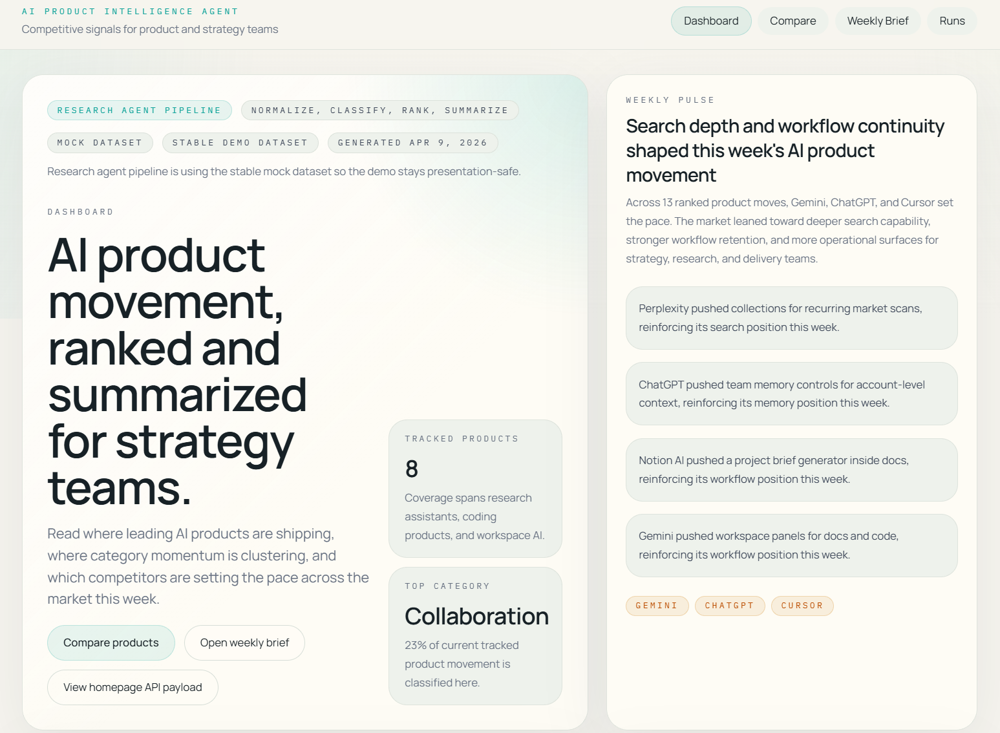

# AI Product Intelligence Agent

一个面向作品集与面试展示的、`mock-first` 的 AI 产品情报系统，用来跟踪 AI 产品更新、提炼关键信号、比较竞争对手，并生成周度洞察。

这个项目从一开始就不是聊天优先产品，也不是通用 RAG demo。它更像一个给产品、战略、研究团队使用的 intelligence dashboard，并在此基础上加入了可审核的 research run 流程，以及 run-scoped 的证据问答能力。

## 这是什么

AI Product Intelligence Agent 用 Next.js 搭建了一个完整的产品情报工作台：

- `/`：把近期 AI 产品动态整理成市场级 dashboard
- `/compare`：对 2 到 3 个产品做频率、主题、方向与 focus pillar 对比
- `/products/[slug]`：查看单个产品的时间线、类别分布、近期重点与方向总结
- `/weekly-brief`：把最近的产品动态整理成一份周报式 brief
- `/runs`：作为 run center，触发官方来源 research run，进入 review / publish 流程
- `/runs/[id]`：查看单次 run 的细节，并使用基于证据的问答助手
- `/api/intelligence`：提供首页所需的统一 intelligence payload

当前版本支持三种运行模式：

- 默认模式：使用稳定的 `mock` 数据，适合演示和截图
- `?mode=live`：拉取官方来源的实时更新
- `?mode=published`：读取最新一份已审核发布的 research run

如果 live 抓取失败，页面会自动回退到 mock，不会直接把 demo 打断。

## 为什么这个项目有价值

很多 AI 项目最后都会变成聊天框，但产品团队和战略团队真正需要的往往不是“问一句答一句”，而是：

- 持续跟踪产品 shipping velocity
- 把零散更新归一化成结构化情报
- 看到竞争格局的变化方向
- 在同一套数据上支持 dashboard、compare、brief、review

所以这个项目的核心不是对话，而是下面这条 intelligence pipeline：

```text
raw updates -> normalize -> classify -> rank -> summarize -> render
```

也正因为如此，页面里的结论不是硬编码文案，而是从数据流水线生成出来的。

## 为什么它可以叫 Agent 系统

这个项目不是那种“用户提问后自主上网、反复调工具”的强自主 agent。  
更准确地说，它现在是一个 `workflow agent / research run system`。

它已经具备的 agent 性在于：

- 可以执行一次跨多个官方来源的 research run
- 可以把抓到的内容自动走完 normalize / classify / rank / summarize
- 可以把结果推进到 `review_required -> published`
- 可以在 run review 阶段基于证据回答问题

它目前还**不是**：

- 不是开放式的 autonomous analyst agent
- 不是会按用户问题自主规划并循环调用工具的 chat agent
- 不是通用型 web research copilot

这点在面试里反而很重要，因为它能让项目描述更真实：  
当前版本已经在工作流层具备 agent 性，但没有夸大成“全自动工具代理”。

## 为什么它也可以算 RAG

这个项目里的 RAG 是有意收窄过的，属于 `run-scoped RAG`，也就是“围绕一次 research run 的证据增强问答”。

当前版本的 RAG 能力包括：

- 每次 run 会把 evidence snippets 和 ranked updates 一起保存
- `/runs/[id]` 里的问答只检索当前这一次 run 的证据
- 配置 `OPENAI_API_KEY` 后，可以生成带 citations 的回答
- 不配置 key 时，也能退化成 retrieval-only 模式
- citation 卡片会展示 rank、score、matched terms、why retrieved，并高亮支持文本

这意味着它不是“全站知识库聊天机器人”，而是：

- 有明确语料边界
- 有明确证据来源
- 有 review 语义
- 有 grounded answer 和 citations

当前检索层也是**本地可解释**的，而不是向量库：

- 证据会按 product、source、category、focus tag、可见文本命中、发布时间等维度打分
- 不是 embedding 检索，也还没有引入 vector database
- 这样做的好处是 demo 稳定、可解释、方便展示“为什么检索到这条证据”

## 演示路径

### 推荐演示顺序

1. 先打开 dashboard，说明它是一个市场级 intelligence view，而不是落地页
2. 切到 compare，展示同一套数据如何支持竞争分析
3. 打开某个产品详情页，说明单产品深挖也来自同一条 pipeline
4. 打开 weekly brief，展示系统如何把产品更新转成叙事化 brief
5. 进入 `/runs` 和 `/runs/[id]`，展示 research run、review、publish 流程
6. 在 run detail 里提问，展示 evidence-grounded 的 RAG 问答和 citation UI

### 面试时可以这样讲

1. 我想做一个更像真实产品团队工具的 AI 项目，而不是再做一个聊天框。
2. 所以我把问题定义成“AI 产品情报系统”，核心是把原始更新转成结构化 intelligence。
3. 首页负责市场级视图，compare 负责竞争格局，weekly brief 负责叙事总结。
4. 在此基础上，我又加了一层 research run workflow，让系统支持 review / publish。
5. 最后在 run review 阶段加入了 run-scoped RAG assistant，让问答建立在可检查的证据之上。

## 产品界面走查

下面这些截图不是静态设计稿，而是当前应用真实运行时生成的界面，所以它们能直接反映系统的数据流和产品定位。

### 1. Dashboard 总览


这是产品的市场级入口。它没有把用户直接送进聊天框，而是先给出本周产品动态、weekly pulse、tracked products 覆盖范围，以及当前模式（`mock` / `live` / `published`）。

这里的目标是让人先快速理解“本周市场发生了什么、为什么重要”，再去钻进更细的产品事件和对比视图。

### 2. Intelligence 视图


这部分展示的是 intelligence pipeline 真正落在页面上的效果。趋势图、类别分布、recent events、category signal table 都是经过 normalize、classify、rank 之后生成的，而不是简单按时间倒序罗列更新。

这也是项目区别于普通 changelog 聚合页的地方：页面展示的是“信号”，不是“原文堆叠”。

### 3. Compare 对比页



Compare 页把同一套 ranked dataset 重新组织成一个决策视图，让产品或战略角色能在一个页面里比较 2 到 3 个产品的节奏、主题、方向和 focus。

这能证明底层 intelligence layer 是可复用的：dashboard 回答“市场发生了什么”，compare 回答“这些产品之间怎么不同”。

### 4. Research Run Agent


这一页展示的是 workflow agent 的核心。一次 run 会执行官方来源抓取、生成 draft brief、记录 source health，并和上一次 run 做 diff。

这让系统不再只是“抓完就显示”，而是有了研究工作流：

- 先抓取
- 再生成草稿
- 再 review
- 最后 publish

这也是它比普通 dashboard 更像 agent 系统的关键一步。

### 5. RAG 问答展示


这张图展示的是 `/runs/[id]` 里的 run-scoped RAG assistant。  
用户不是对整站任意发问，而是围绕当前这次 run 提问题，例如“本次 run 里哪个产品的 workflow movement 最强”。

这一页能看到几个关键点：

- assistant 可以输出 answer
- 可以显示 retrieval-only 或 LLM 模式
- 会展示 supporting evidence
- citation 卡片会显示 evidence rank、score、matched terms
- 标题和 snippet 中的支持词会被高亮
- `Why retrieved` 会解释为什么系统选择了这条证据

这让问答结果不再是黑箱生成，而是一个 reviewer 可以检查、可以解释、可以回到来源的 grounded answer。

## 技术栈

- Next.js 16 + App Router
- React 19
- TypeScript
- Tailwind CSS 4
- Recharts
- Vitest
- 单一首页 API route

这版实现中的几个关键工程选择：

- 先做 `mock-first`，保证 MVP 可完整演示
- 分类、排序、摘要优先使用规则化逻辑，保证系统可解释
- 所有页面和 API 复用 shared builders，避免多套数据逻辑漂移
- run store 用本地 JSON，避免一开始引入数据库
- RAG 做成 run-scoped、citation-first，而不是一上来做全站聊天机器人

## 数据与流程

核心 intelligence 文件位于 `src/lib/intelligence/`：

- `raw-updates.ts`：mock 原始更新数据
- `update-normalizer.ts`：原始文本到统一内部结构
- `update-classifier.ts`：分类、change type、focus tag、importance
- `update-ranker.ts`：结合 recency 与 importance 做排序
- `summary-generator.ts`：生成 weekly insight、产品方向总结、compare narrative
- `builders.ts`：组装 dashboard / detail / compare / brief payload
- `types.ts`：定义 `DashboardPayload`、`WeeklyInsight`、`ProductInsight`、`ComparisonSnapshot`
- `run-store.ts`：research run 与 published pointer 的本地持久化
- `run-evidence.ts`：从 run 中生成与补齐 evidence snippets
- `research-run-agent.ts`：执行官方来源 ingestion 与 draft 生成
- `run-question-answering.ts`：run-scoped 检索与可选 OpenAI 生成回答
- `run-types.ts`：定义 `RunStatus`、`ResearchRun`、`RunEvidence` 等运行时类型

当前跟踪的产品：

- ChatGPT
- Claude
- Perplexity
- Notion AI
- Cursor
- Devin
- Gemini
- Figma AI

当前使用的主要类别：

- agent
- search
- memory
- workflow
- collaboration
- pricing
- developer tools

## 本地运行

安装依赖：

```bash
npm.cmd install
```

启动开发服务器：

```bash
npm.cmd run dev
```

打开：

- [http://localhost:3000](http://localhost:3000)

### 可选 OpenAI 配置

如果你想让 `/runs/[id]` 的问答从 retrieval-only 升级成带生成回答的 RAG，可以配置：

```bash
OPENAI_API_KEY=your_key_here
OPENAI_MODEL=gpt-5.4-mini
```

如果不配置，assistant 仍然可以工作，只是不会调用模型，而是展示 retrieval-only 的回答和证据卡片。

### 推荐访问路径

- [http://localhost:3000](http://localhost:3000)
- [http://localhost:3000/?mode=live](http://localhost:3000/?mode=live)
- [http://localhost:3000/?mode=published](http://localhost:3000/?mode=published)
- [http://localhost:3000/compare?mode=live](http://localhost:3000/compare?mode=live)
- [http://localhost:3000/weekly-brief?mode=published](http://localhost:3000/weekly-brief?mode=published)
- [http://localhost:3000/runs](http://localhost:3000/runs)
- [http://localhost:3000/api/intelligence?mode=live](http://localhost:3000/api/intelligence?mode=live)

`?mode=live` 不需要额外 live-data env；当前语义就是走官方来源抓取。

## Run Center 与 Published 模式

使用 `/runs` 触发并审核官方来源 research run：

1. 点击 `Run official ingestion now`
2. 等待 run 完成并打开 `/runs/[id]`
3. 查看 draft weekly brief、source health 和 ranked updates
4. 向 run assistant 提问，查看 supporting evidence
5. 检查 citation rank、score、matched terms、why retrieved 和高亮文本
6. 点击 `Publish reviewed run`
7. 打开 `/?mode=published` 或 `/weekly-brief?mode=published`

run store 使用本地 JSON：

- `data/runs/index.json`：保存 run 列表和最新 published 指针
- `data/runs/runs/<runId>.json`：保存单次 run 的 products、updates、evidence、weekly insight、source health

这样做的好处是：本地就能完整演示工作流，不需要数据库和登录系统。

## 验证命令

```bash
npm.cmd run lint
npm.cmd run test
npm.cmd run build
```

如果在 Windows PowerShell 里直接运行 `npm` 遇到 execution policy 问题，就继续使用 `npm.cmd`。

## Vercel 部署

项目已经适合直接部署到 Vercel：

1. 将仓库导入 Vercel
2. 使用默认 Next.js 构建配置
3. 设置 `NEXT_PUBLIC_SITE_URL` 为你的线上域名
4. 如果想启用问答生成能力，再配置 `OPENAI_API_KEY`

## 官方 Live 来源

默认情况下，`?mode=live` 会从官方来源抓取：

- OpenAI News RSS
- Claude Help Center release notes
- Perplexity API docs changelog
- Notion releases
- Cursor changelog
- Devin docs release notes
- Google Workspace Updates Gemini feed
- Figma release notes

只要至少一个来源成功，系统就会保留 live 模式；只有全部失败时，才会整体回退到 mock。

## 后续可以怎么扩展

下一步最值得做的不是继续堆页面，而是加强真实数据和研究深度：

- 增加更稳定的 provider 与更多官方来源
- 增加历史快照持久化
- 做定时 ingestion 与去重
- 在当前 run center 之上增加多人 review / auth
- 把当前本地检索升级成 hybrid retrieval 或 vector-backed retrieval
- 在保留 citation inspection 的前提下增强生成层

如果从作品集和面试角度看，这个项目最强的扩展路线其实是：

- 保持当前 UI 契约稳定
- 只替换或增强 raw provider / retrieval layer
- 继续沿用现有的 normalize / classify / rank / summarize / render / review / publish 工作流
