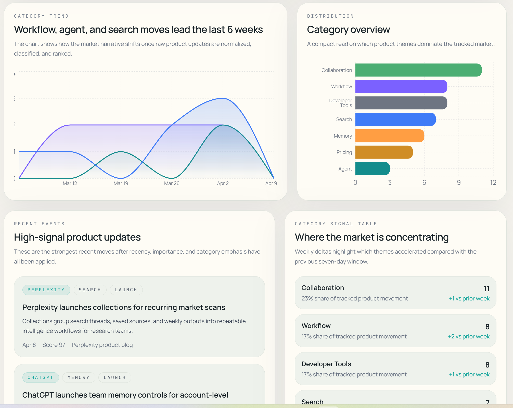
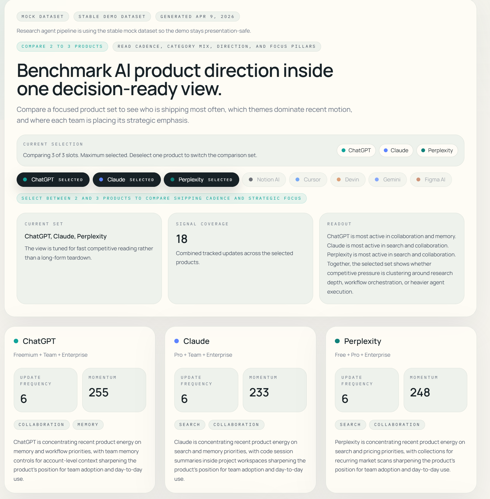
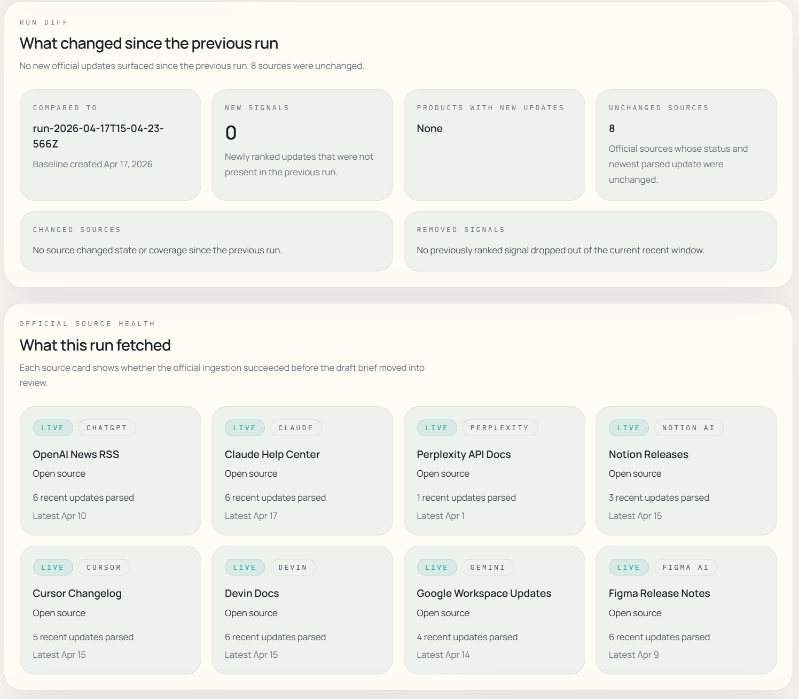
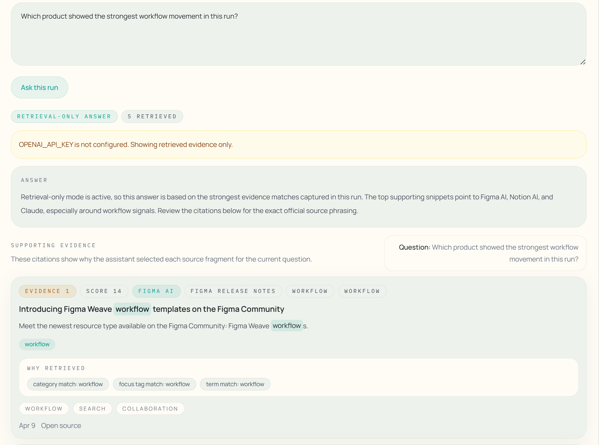

# AI Product Intelligence Agent

一个面向 AI 产品研究与竞争分析的情报系统，用于持续跟踪产品更新、提炼结构化信号、生成周度摘要，并支持基于证据的研究问答。

这个项目的重点不在聊天交互本身，而在于把分散的产品更新整理成一个可读取、可比较、可审核的 intelligence workflow。当前版本已经包含官方来源抓取、研究 run、审核发布流程，以及轻量级的 run-scoped RAG assistant。

## 项目概览

系统围绕一条统一的数据处理链路工作：

```text
source updates -> normalize -> classify -> rank -> summarize -> review -> publish
```

在这条链路上，应用提供了几类核心能力：

- 产品动态总览：把近期 AI 产品更新整理成市场级 dashboard
- 单产品洞察：查看某个产品的时间线、类别分布与近期方向
- 周报摘要：把近期信号压缩成 weekly brief
- 研究工作流：执行一次 research run，查看 source health、diff、草稿摘要并决定是否发布
- 证据问答：围绕某次 run 的证据片段提问，并返回 grounded answer 与 citations

## 系统结构

当前应用主要由四层组成：

### 1. Ingestion

系统会从一组固定的官方来源抓取更新内容，当前覆盖：

- ChatGPT
- Claude
- Perplexity
- Notion AI
- Cursor
- Devin
- Gemini
- Figma AI

这些来源会被统一转成内部 `RawUpdate` 结构，再进入后续处理流程。

### 2. Intelligence Pipeline

原始更新进入系统后，会依次完成：

- `normalize`：提取产品、标题、摘要、发布时间等基础字段
- `classify`：识别 category、change type、focus tag、importance
- `rank`：结合 recency 与 importance 做排序
- `summarize`：生成 weekly insight、product direction、brief narrative

这意味着页面上的核心结论不是手写文案，而是从同一套 intelligence pipeline 推导出来的。

### 3. Research Run Workflow

系统支持以 run 为单位执行一次研究流程。一次 run 会：

- 抓取官方来源
- 记录 source health
- 生成 ranked updates
- 生成 draft weekly brief
- 保存 evidence snippets
- 进入 `review_required`
- 支持 `publish` 或 `reject`

发布后的结果会成为 `published` 模式读取的快照。

### 4. Run-Scoped RAG Assistant

在 `/runs/[id]` 页面中，系统提供了一个轻量级问答助手。

它的工作方式很简单：

- 只检索当前这一次 run 中保存的 evidence snippets
- 先做本地可解释的 evidence ranking
- 如果配置了 `OPENAI_API_KEY`，再基于检索结果生成回答
- 所有回答都附带 citations

这层设计的目的不是做一个全站聊天机器人，而是让研究结果在 review 阶段更容易被验证、追踪和复查。

## 页面说明

### `/`

首页是市场级 intelligence dashboard，用来快速回答两个问题：

- 最近哪些 AI 产品动作最值得关注
- 目前市场的主题正在往哪里集中

### `/products/[slug]`

单产品页面用于查看某个产品的：

- 更新时间线
- 类别分布
- 近期关注方向
- 方向总结

### `/weekly-brief`

周报页会把近期信号组织成更适合阅读的摘要，包括：

- headline
- summary
- notable signals
- watchlist

### `/runs`

Run Center 用于触发和查看 research run 历史。

### `/runs/[id]`

Run Detail 用于查看某次 run 的：

- draft weekly brief
- ranked signals
- source health
- run diff
- 基于证据的问答结果

## 界面截图

### Dashboard 总览



首页强调的是“市场视图”而不是单条更新。用户先看到本周产品动态、主题变化和值得关注的产品，再进入更细的明细页面。

### Intelligence 视图



趋势图、类别分布、recent events 与 category signal table 都来自同一条 pipeline。这里展示的是经过筛选和排序后的信号，而不是原始 changelog 的堆叠。

### Research Run



这一页对应 research run 的核心流程。一次 run 会聚合官方来源、生成草稿、记录来源状态，并和前一次 run 做 diff。系统不只是“抓取后展示”，而是有完整的 review / publish 过程。

### RAG 问答展示



这张图展示的是 `/runs/[id]` 中的问答能力。问题会围绕当前 run 的证据集合展开，系统返回 answer、supporting evidence、citation rank、retrieval score、matched terms 与高亮支持文本。

这一页最重要的不是“答得像不像聊天机器人”，而是：

- 回答是否有依据
- 证据是否可追溯
- 检索为什么命中是否可解释

## 技术栈

- Next.js 16
- React 19
- TypeScript
- Tailwind CSS 4
- Recharts
- Vitest

## 关键实现点

- 使用统一的 intelligence builders，为 dashboard、detail、brief 等页面提供一致的数据来源
- research run 结果持久化到本地 JSON，便于 review / publish
- 问答层使用 run-scoped evidence retrieval，避免脱离当前研究上下文
- retrieval 采用本地可解释打分，而不是直接依赖向量库
- citation UI 会展示 evidence rank、score、matched terms、why retrieved 与高亮文本

## 目录说明

核心逻辑主要位于 `src/lib/intelligence/`：

- `raw-updates.ts`：原始更新数据
- `update-normalizer.ts`：标准化处理
- `update-classifier.ts`：分类与标签提取
- `update-ranker.ts`：排序逻辑
- `summary-generator.ts`：摘要生成
- `builders.ts`：页面数据组装
- `research-run-agent.ts`：research run 执行逻辑
- `run-store.ts`：run 持久化
- `run-evidence.ts`：evidence snippets 生成与补齐
- `run-question-answering.ts`：run-scoped 检索与问答

## 本地运行

安装依赖：

```bash
npm.cmd install
```

启动开发服务器：

```bash
npm.cmd run dev
```

打开：

- [http://localhost:3000](http://localhost:3000)

## 环境变量

如果希望启用问答中的生成式回答，可以配置：

```bash
OPENAI_API_KEY=your_key_here
OPENAI_MODEL=gpt-5.4-mini
```

如果不配置，系统仍然可以正常工作，只是问答部分会保持 retrieval-only 模式。

## 数据模式

系统支持三种数据模式：

- 默认模式：稳定数据集，适合日常查看和界面演示
- `?mode=live`：官方来源实时抓取
- `?mode=published`：读取最近一次已发布的 research run

常用访问方式：

- [http://localhost:3000](http://localhost:3000)
- [http://localhost:3000/?mode=live](http://localhost:3000/?mode=live)
- [http://localhost:3000/?mode=published](http://localhost:3000/?mode=published)
- [http://localhost:3000/runs](http://localhost:3000/runs)
- [http://localhost:3000/api/intelligence?mode=live](http://localhost:3000/api/intelligence?mode=live)

## 验证命令

```bash
npm.cmd run lint
npm.cmd run test
npm.cmd run build
```

如果在 Windows PowerShell 里直接运行 `npm` 遇到 execution policy 限制，可以继续使用 `npm.cmd`。

## 部署

项目可以直接部署到 Vercel：

1. 导入仓库
2. 保持默认 Next.js 构建配置
3. 设置 `NEXT_PUBLIC_SITE_URL`
4. 如需启用生成式问答，再配置 `OPENAI_API_KEY`

## 后续方向

下一步更值得继续做的方向包括：

- 增强官方来源覆盖和稳定性
- 引入定时 ingestion 与去重策略
- 保存更多历史快照
- 增加多人 review / auth
- 将当前本地检索升级为 hybrid retrieval 或 vector-backed retrieval
- 在保留 citation inspection 的前提下继续增强生成层
